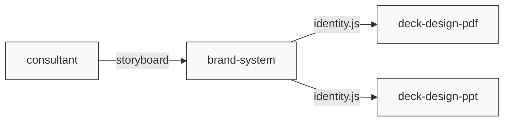

# Presentation Skills

Claude Code / Codex skills for end-to-end consulting-quality presentations.

## Quick start

> [!TIP]
> Clone this repo anywhere you keep your skills, then symlink each skill into your agent's skills directory.

```sh
git clone <repo-url> ~/skills/presentation
cd ~/skills/presentation

# Claude Code
for s in consultant brand-system deck-design-pdf deck-design-ppt; do
  ln -s "$(pwd)/$s" ~/.claude/skills/$s
done

# Codex
for s in consultant brand-system deck-design-pdf deck-design-ppt; do
  ln -s "$(pwd)/$s" ~/.codex/skills/$s
done
```

> [!IMPORTANT]
> Three skills include rendering engines with their own `node_modules/`. Install after cloning:
> ```sh
> cd brand-system && npm install
> cd ../deck-design-pdf && npm install
> cd ../deck-design-ppt && npm install
> ```

## Skills

| Skill | What it does |
|---|---|
| [consultant](consultant/) | Strategic analysis and storyboarding — McKinsey, BCG, or Bain methodology |
| [brand-system](brand-system/) | Color palette, font pairing, and style direction — produces `identity.js` |
| [deck-design-pdf](deck-design-pdf/) | Pixel-perfect PDF decks via HTML/Tailwind/Playwright |
| [deck-design-ppt](deck-design-ppt/) | Editable PPTX decks via pptxgenjs |

## Pipeline



Each skill also works independently.

## Repo structure

> [!NOTE]
> **`vendor/`** folders (fonts, icons, chart libs) are committed. They enable offline rendering with zero network dependency at build time.
>
> **`node_modules/`** folders are gitignored. Run `npm install` per skill after cloning.

## License

MIT

---

🤖 Checkout [linux.do](https://linux.do) for more fun stuff about AI!
